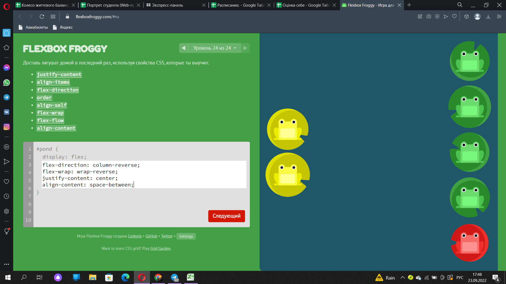
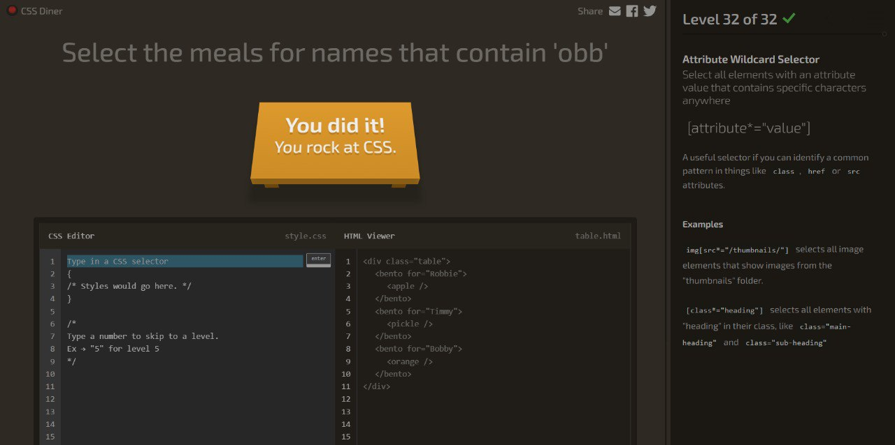
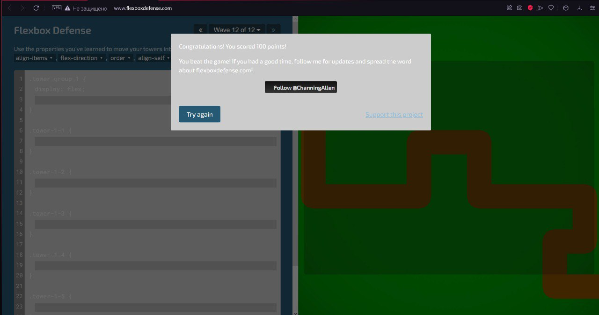

<!DOCTYPE html>
<html lang="en">
<head>
    <meta charset="UTF-8">
    <meta http-equiv="X-UA-Compatible" content="IE=edge">
    <meta name="viewport" content="width=device-width, initial-scale=1.0">
    <title>Document</title>
</head>
<body>
    
    
    
 Другий сатй зовсім не сподобався. Було тяжко зрозуміти як робити завдання. Теорія не зрозуміла!
 
    
    
Сайт сподобався. Все зрозуміло, особоливо класно, коли проходиш після первошо сайту :)
  
</body>
</html>
